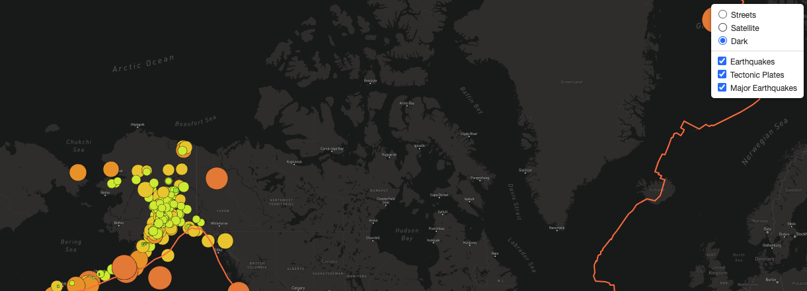

# Mapping_Earthquakes
In this module, you will use the Leaflet.js Application Programming Interface (API) to populate a geographical map with GeoJSON earthquake data from a URL. Each earthquake will be visually represented by a circle and color, where a higher magnitude will have a larger diameter and will be darker in color. In addition, each earthquake will have a popup marker that, when clicked, will show the magnitude of the earthquake and the location of the earthquake.

### Overview

An earthquake map was created with two different maps and the earthquake overlay. The map is then modified to include the earthquake data in relation to the tectonic plates’ location on the earth, show all the earthquakes with a magnitude greater than 4.5 on the map, and include a third map layer option.

### Results

Deliverable 1: Add Tectonic Plate Data:

*Using JavaScript, Leaflet.js, and geoJSON data, a tectonic plate data was added using d3.json(), the data is added using the geoJSON() layer, the tectonic plate is set using LineString data to stand out on the map, and the tectonic plate data is added to the overlay object with the earthquake data.*

Deliverable 2: Add Major Earthquake Data:

*Using JavaScript, Leaflet.js, and geoJSON data, a major earthquake data was added to the map using d3.json(), and a color and set the radius of the circle based on the magnitude of earthquake, and a popup marker for each earthquake that displays the magnitude and location of the earthquake using the GeoJSON layer is also added, geoJSON().*

Deliverable 3: Add an Additional Map:

*Using JavaScript and Leaflet.js a third map style "dark-v10" was added to the earthquake map.*

